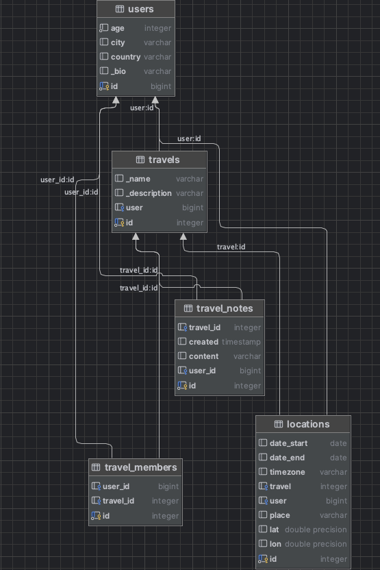

# Travel agent

## Установка

Нужно склонировать данный репозиторий к себе и перейти в папку проекта

```bash
git clone https://github.com/timka-123/travelagent
cd travelagent
```

## Запуск

Перед запуском проекта необходимо добавить в переменные среды значения `BOT_TOKEN` (токен бота от @BotFather), `YANDEX_S3_ID` (id учетной записи s3 хранилища), `YANDEX_S3_SECRET` (секретное слово  учетной записи s3 хранилища)

Проект запускается через Docker Compose

```bash
docker-compose up
```

Эта команда запустит проект и вы сможете пользоваться ботом!


## Стек технологий

В проекте используются следующие технологии:
- Aiogram (асинхронная библиотека для создания Telegram ботов)
- PosgresQL (релякционная БД, выбрана, так как имеет большие возможности нежели MySQL и подобные, к примеру, поддержку массивов)
- OpenStreetMap (отвечает за любую картографическую составляющую в проекте)
- S3-хранилище (используется для более грамотного и надежного хранения файлов, загружаемые в бот). В качестве провайдера используется Yandex Cloud, но это можно настроить переменной `S3_ENDPOINT` в `docker-compose.yml`


## Схема БД



## Описание структуры
- `users` - основная таблица, где хранится основная информация о пользователе
- `travels` - таблица, в которой хранится основная информация о поездках (название и описание) и является опорной для следующих таблиц
- `travel_notes` - таблица, в которой хранятся заметки. Медиафайлы сохраняются в формате ссылок на S3 хранилище
- `travel_members` - таблица с участниками путешествия (кто имеет к нему доступ)
- `locations` - таблица, предназначенная для хранения информации о локациях путешествиятыли
